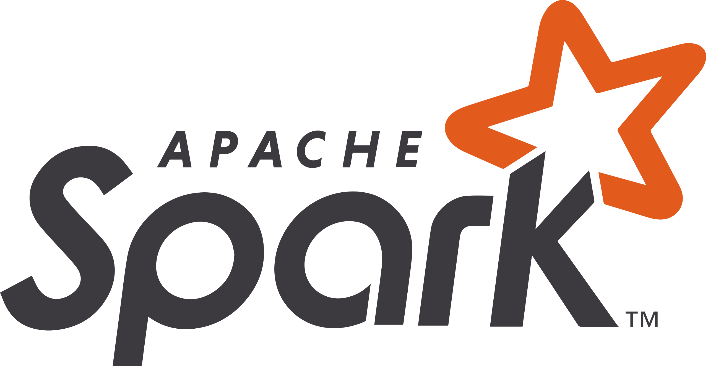

<h1 align="left" id="omar-title">👋 Hey there, I'm Omar</h1>
<h3 align="left">Software & AI Engineer | Building Scalable, Cloud-Native, and Intelligent Systems</h3>

  
  
  

- 🏦 &nbsp;Previously worked in **Fintech**, building scalable backend and AI-driven systems.
- 🤖 &nbsp;Currently exploring **Agentic AI**, **workflow automation**, and **infrastructure intelligence**.
- ☁️ &nbsp;Cloud-native mindset: **GCP**, **AWS**, **Docker**, **Kubernetes**, **Terraform**.
- 🧠 &nbsp;Love designing backend architectures that **learn, adapt, and evolve**.
- ✍️ &nbsp;I share my thoughts on **AI systems, cloud architecture, and automation**.

 

<h2 align="left" id="omar-tech">🧩 Favorite Tech Stack</h2>

> Tools, languages, and frameworks I enjoy working with.

<table>
  <tr>
    <td align="center" width="96">
      
       Java
    </td>
    <td align="center" width="96">
      
       Python
    </td>
    <td align="center" width="96">
      
       Scala
    </td>
    <td align="center" width="96">
      
       Docker
    </td>
    <td align="center" width="96">
      
       Kubernetes
    </td>
    <td align="center"  width="96">
      
       AWS
    </td>
    <td align="center" width="96">
      
       GCP
    </td>
    <td align="center" width="96">
      
       Spark
    </td>
  </tr>
</table>

<h2 align="left">⚙️ Areas of Focus</h2>

> System Design • Cloud Infrastructure • MLOps • Agentic AI • Backend Architecture • Workflow Automation  

I love solving complex problems where **data, cloud, and intelligence** intersect — from building robust APIs to integrating AI agents into scalable infrastructures.
